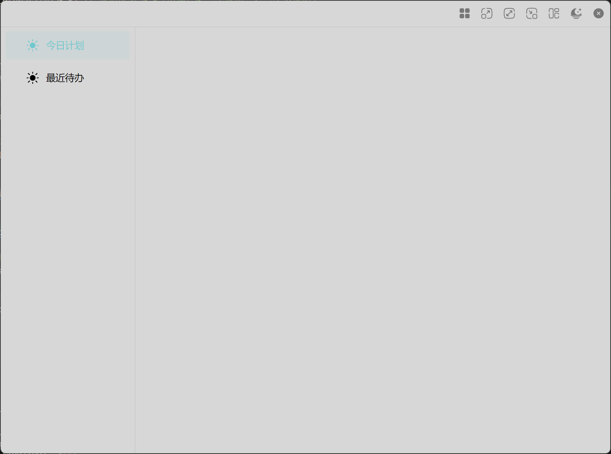
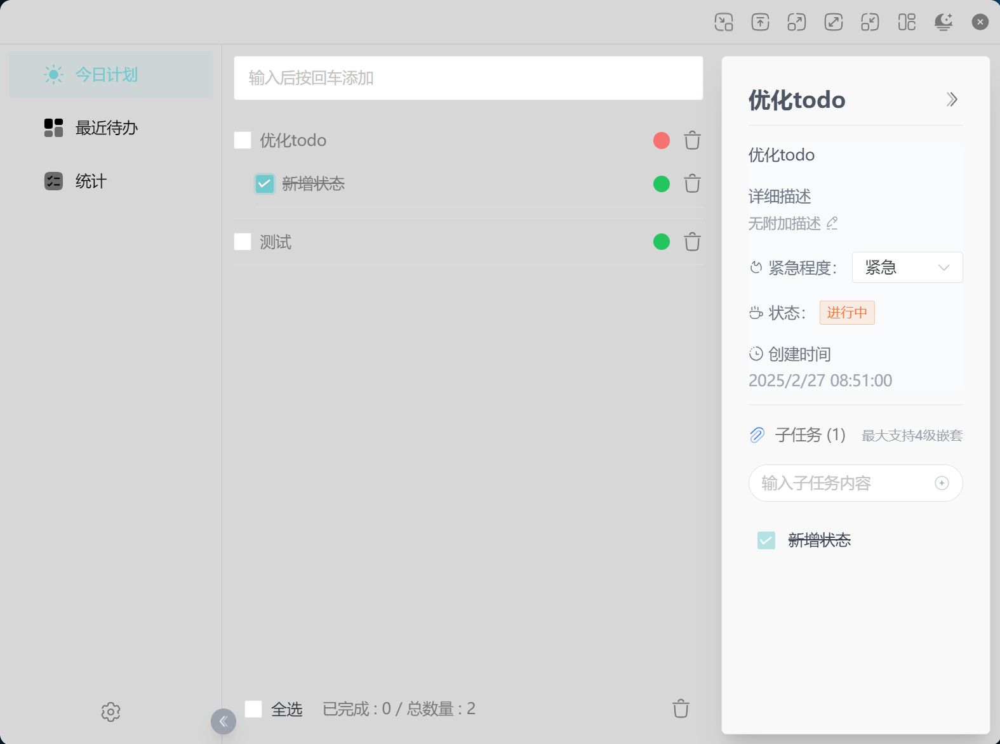
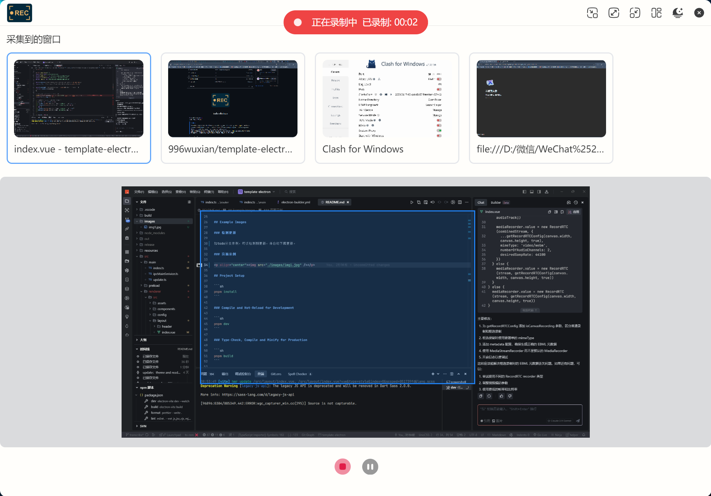
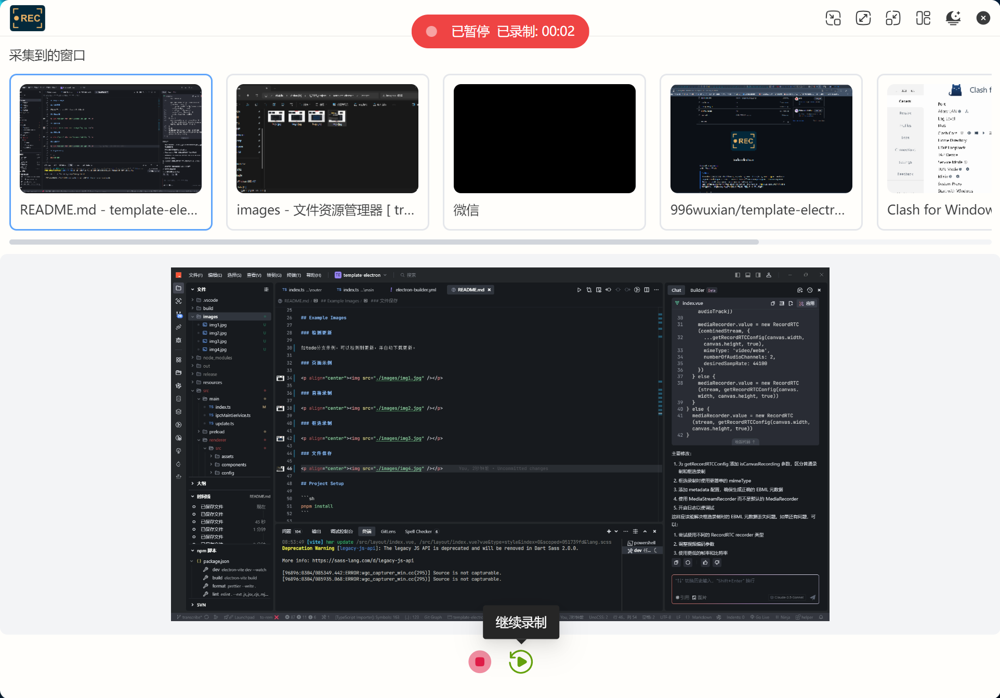
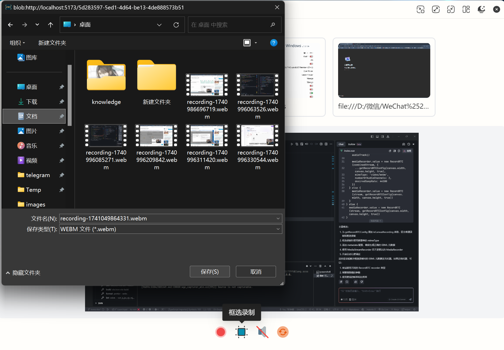

<p align="center"></p>

<h1 align="center">transcribe-electron</h1>

It's a transcribe app.
<br>
这是一个录屏应用。

> [!NOTE]
> If you think `TranscribeElectron` is helpful to you, or you like my project, please give my project a ⭐️ on GitHub. Your support is the driving force for me to continue to improve! Thank you for your support! If there are any areas that are not good enough, please raise an issue and I will improve it!
> <br>
> 如果你认为TranscribeElectron对你有帮助，或者你喜欢我的项目，请给我的项目一个⭐️ 在GitHub上。您的支持是我不断改进的动力！感谢您的支持！如果有什么地方不够好，请提出issue，我会改进的！

## Introduction

使用了electron + vue3 + vite + recordrtc实现的一个录屏应用, 主要实现了窗口采集、直接录屏、框选录屏、录取声音、暂停/继续、文件保存、窗口刷新等功能，唯一不足的点是，框选录屏的视频没有进度条和总时长，希望后续能优化。

## Recommended IDE Setup

推荐的IDE：

[VSCode](https://code.visualstudio.com/)：我已配置了Prettier和Eslint，您可以结合VsCode对应的插件使用，这将减少您手动格式化代码的麻烦。
node版本: v20.9.0
pnpm版本: 8.8.0

## Example Images

### 检测更新

如todo分支示例，可以检测到更新，并自动下载更新。

### 页面示例

<p align="center"></p>

### 直接录制

<p align="center"></p>

### 框选录制

<p align="center"></p>

### 暂停/继续

<p align="center"></p>

### 文件保存

<p align="center"></p>

## Project Setup

```sh
pnpm install
```

### Compile and Hot-Reload for Development

```sh
pnpm dev
```

### Type-Check, Compile and Minify for Production

```sh
pnpm build
```

### Lint with [ESLint](https://eslint.org/)

```sh
pnpm lint
```
