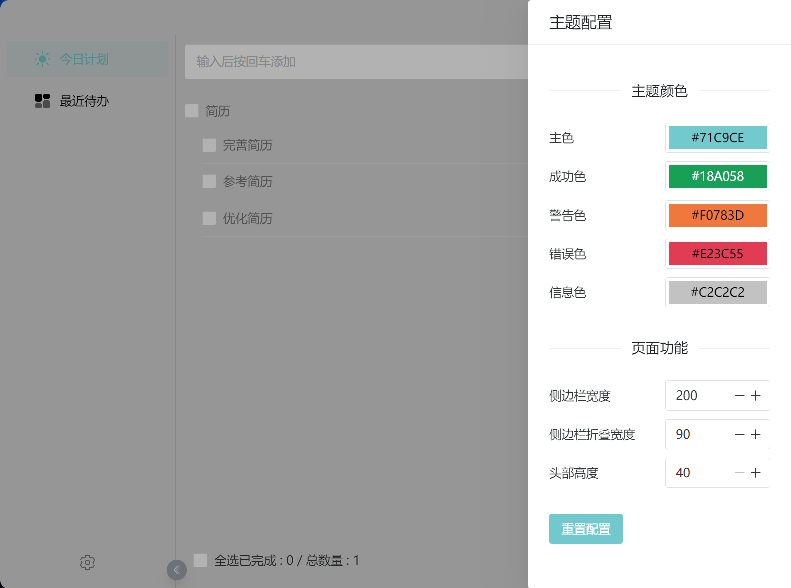

<p align="center"></p>

<h1 align="center">todo-electron</h1>

It's a todo surrogate app.
<br>
这是一个todo代办应用。

> [!NOTE]
> If you think `TodoElectron` is helpful to you, or you like my project, please give my project a ⭐️ on GitHub. Your support is the driving force for me to continue to improve! Thank you for your support! If there are any areas that are not good enough, please raise an issue and I will improve it!
> <br>
> 如果你认为TodoElectron对你有帮助，或者你喜欢我的项目，请给我的项目一个⭐️ 在GitHub上。您的支持是我不断改进的动力！感谢您的支持！如果有什么地方不够好，请提出issue，我会改进的！

## Introduction

该模板使用Electron + Vue3 + Ts + Vite + Pinia + UnoCss + Naive UI搭建，配置了Prettier和Eslint，提供了自定义头部，全屏，固定到右上角置顶，悬浮窗，贴边显示隐藏，最小化动画，前端路由和动态路由，请求封装，全局loading，进度条、主题布局配置、全局颜色修改、Icon使用[UnoCss图标预设](https://icones.js.org/collection/solar)，封装了对应的svg-icon组件，可以通过使用`svg-icon name="..."`引入对应的svg图标，对应[Svg图标预设](https://yesicon.app/logos/?lang=zh-hans)，希望这个可以作为您的初始化项目模板，供您拓展和自定义属于您的项目。

## Recommended IDE Setup

推荐的IDE：

[VSCode](https://code.visualstudio.com/)：我已配置了Prettier和Eslint，您可以结合VsCode对应的插件使用，这将减少您手动格式化代码的麻烦。
node版本: v20.9.0
pnpm版本: 8.8.0

## Example Images

### 页面示例

<p align="center"></p>
<p align="center" style="margin-top: 10px"></p>
<p align="center" style="margin-top: 10px"></p>

### 主题配置

<p align="center" style="margin-top: 10px"></p>

### 悬浮窗

<p align="center" style="margin-top: 10px"></p>

### 固定到右上角

<p align="center" style="margin-top: 10px"></p>

### 锁定

<p align="center" style="margin-top: 10px"></p>

### 贴边隐藏/显示

<p align="center" style="margin-top: 10px"></p>
<p align="center" style="margin-top: 10px"></p>

### 本地存储数据

<p align="center" style="margin-top: 10px"></p>

## Project Setup

```sh
pnpm install
```

### Compile and Hot-Reload for Development

```sh
pnpm dev
```

### Type-Check, Compile and Minify for Production

```sh
pnpm build
```

### Lint with [ESLint](https://eslint.org/)

```sh
pnpm lint
```
